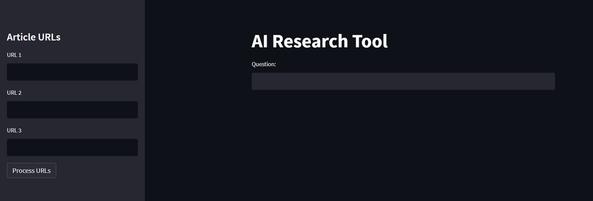
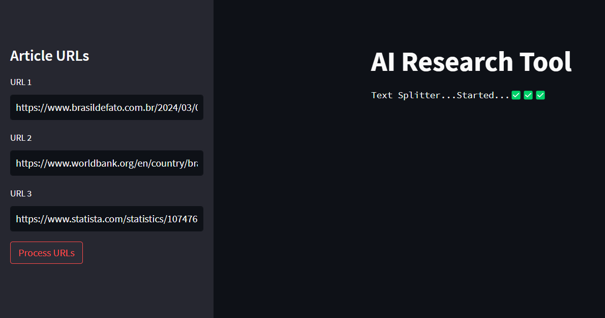

# AI Research Bot

This Python and Streamlit project leverages GPT-4 to craft an AI research assistant. Feed it articles, and it extracts key insights through a user-friendly interface, empowering efficient data exploration. Ask any question or queries related to the given articles to app and it will present you the desired answer.

## **User Interface**

## **While Article Processing**

## **Note;**
The GPT4 API Key is necessary for this web app to run properly which key is paid version. Because my api key has reached its limit and used all the tokens, I could not paste the final output of the app here. If you use GPT3.5 API it will end up with error due to lack of support of web scrapping in GPT3.5. So it is mandatory, you need GPT4 API Key. After you get the key from OpenAI, put that key in **.env** file in the directory.
